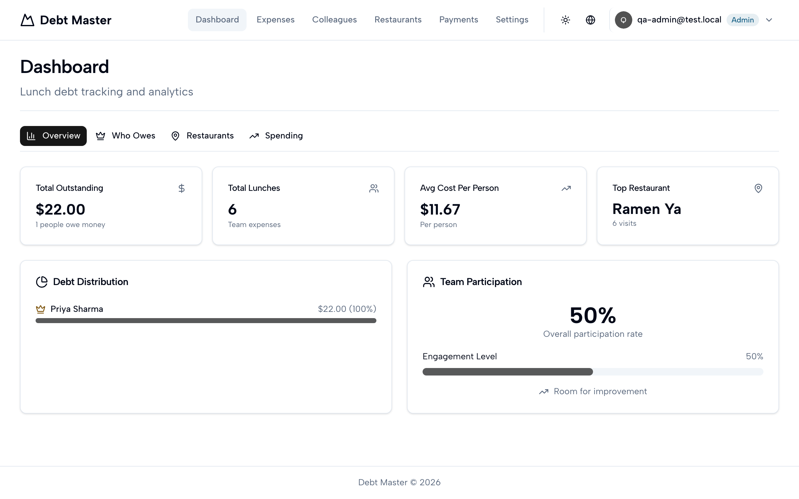

# Debt Master

**A free, open-source, self-hosted Splitwise alternative for workplace lunch debts.**

Someone orders for the whole table. Someone else covers the taxi. A month later nobody remembers who owes what, and the group chat gets weird. Debt Master is a running ledger for teams that eat together: it keeps the tab, so you do not have to.

<p align="center">
  
</p>

## What it does

- Admins log shared lunches and payments in about a minute.
- Every colleague sees their own running tab in the browser.
- Payments clear only when both sides confirm them — settled means settled, on the record.
- Colleagues sign in with an access code. No passwords to forget, no accounts to herd.
- Self-hosted: names and amounts never leave your server.

## Why not just use Splitwise?

Splitwise is great at splitting a trip. A workplace lunch tab is a different shape — it never ends, and colleagues should not need an account in yet another cloud app.

|  | Splitwise | Debt Master |
| --- | --- | --- |
| Shape | One-off group splits | A running ledger that never resets |
| Hosting | Their cloud | Your server, one Docker container |
| Colleague signup | Full accounts for everyone | One access code each, no passwords |
| Settling a debt | Someone remembers it's paid | Both sides confirm it, and it's on the record |
| Price | Free tier with ads, Pro plan above | Free. MIT. The whole thing. |

## Requirements

- Docker with Compose v2 (the `docker compose` subcommand)
- About 1 vCPU and 1 GB of RAM

The published image is amd64. On ARM hosts (like Apple Silicon) Docker emulates it, which works but runs slower.

## Quickstart

```sh
git clone https://github.com/hogan-yan/debt-master.git
cd debt-master
cp .env.example .env
```

Edit `.env` and set the three required secrets (each one: `openssl rand -base64 32`):

- `POSTGRES_PASSWORD`
- `BETTER_AUTH_SECRET`
- `JWT_SECRET`

If you will run first-time setup from a public hostname (a VPS or cloud host), also set `SETUP_TOKEN`. Local setups can skip it.

Start the stack:

```sh
docker compose up -d --wait
```

`--wait` returns once the database is healthy and the app has passed its healthcheck. Migrations run automatically before the app starts serving, so there is nothing else to set up. If you like proof:

```sh
curl http://localhost:3000/health
# {"status":"ok","db":"up"}
```

Then open http://localhost:3000 and follow the setup wizard to create your admin account. The wizard locks itself permanently once the first admin exists.

The full guide lives in [docs/self-hosting.md](docs/self-hosting.md): every environment variable, backups, upgrades, and reverse-proxy notes.

## Managed hosting

A fully managed hosted version is planned.

## Development

This repository is the official public distribution of Debt Master and receives synced releases from the project's development repository. Issues are welcome; use it, break it, tell us what happened.

## License

[MIT](LICENSE)
